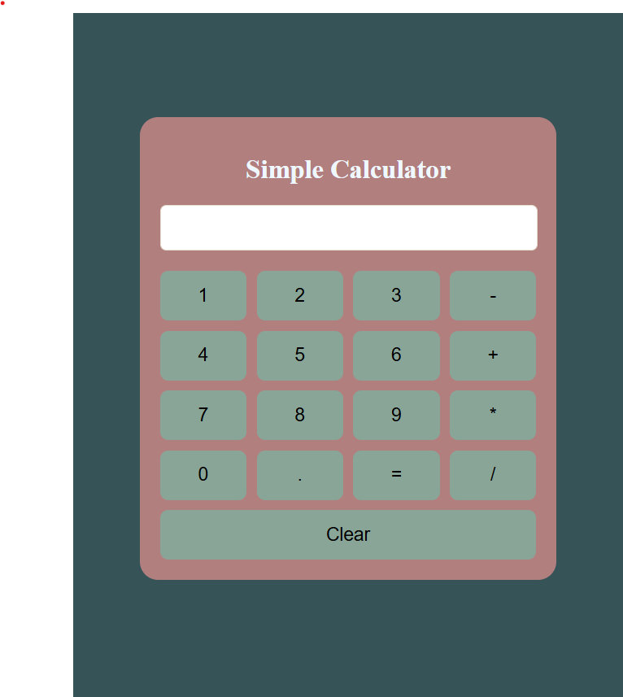

# 🧮 React Calculator

A simple **React** application that implements a basic **calculator** with support for arithmetic operations like addition, subtraction, multiplication, and division.

## 📌 Features
- ✅ **Basic Calculator**: Perform arithmetic operations (addition, subtraction, multiplication, division).
- ✅ **Responsive Design**: Works across different screen sizes and devices.
- ✅ **Clear Button**: Reset the calculator with the "Clear" button.
- ✅ **Error Handling**: Displays an error when division by zero occurs.
- ✅ **Clean UI**: Minimalist user interface with clear button and display.

## 🛠️ Technologies Used
- ⚛️ **React** (useState for state management and input handling)
- 🎨 **CSS** (for styling the calculator interface)
- 📄 **HTML** (for structuring content)
- 

## 🚀 Live Demo
To see it in action, clone the repository and follow the setup instructions below.

## 🚀 Getting Started

1. **Clone the repository:**

   ```bash
   git clone https://github.com/Eshhaa11/simple-calculator
   
2. **Navigate to the project directory:**

   cd simple-calculator

3. **Install dependencies:**

   npm install

4. **Start the development server:**

   npm start

5. **Open your browser and visit:**

   http://localhost:3000

 ## 🎨 Screenshots:
 

##🤝 Contributing
Want to improve this project? Fork the repository, create a feature branch, and open a pull request. All contributions are welcome! 🚀✨

🎉 Happy Coding!